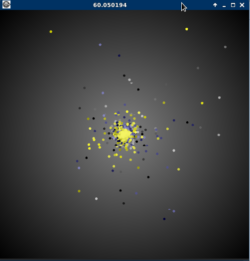
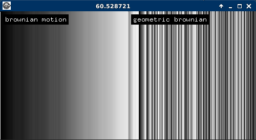

# ofxMarkov

A small collection of functions for statistical and stochastic processes
for the study of probability.

# Poisson process
https://en.wikipedia.org/wiki/Poisson_point_process

# Brownian motion 
https://en.wikipedia.org/wiki/Brownian_motion

# Geometric brownian motion
https://en.wikipedia.org/wiki/Geometric_Brownian_motion

# Continuous Markov chain
https://en.wikipedia.org/wiki/Markov_chain#Continuous-time_Markov_chain

# Discrete Markov chain
https://en.wikipedia.org/wiki/Markov_chain#Discrete-time_Markov_chain

 
 
